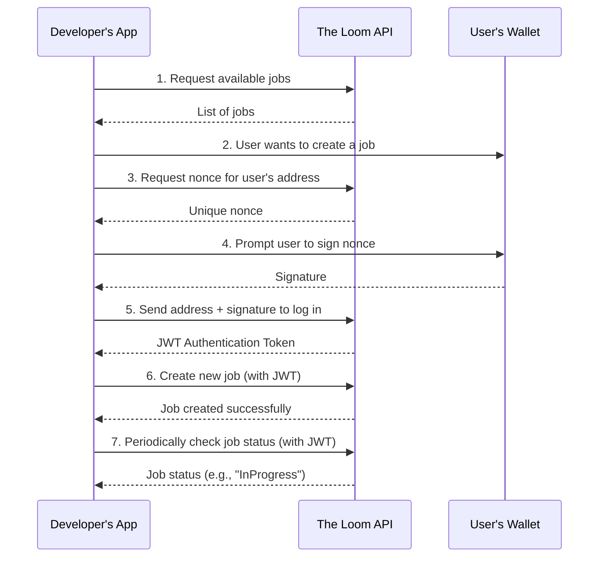

# API Overview

The Loom API provides a programmatic interface to our decentralized computing marketplace. It's designed around RESTful principles, using predictable, resource-oriented URLs and standard HTTP response codes to indicate API errors.

All API responses are returned in JSON format.

**Base URL:** `https://api.the-loom.io/v1`

---

## Authentication

Public endpoints, such as those for browsing the job marketplace, are open and do not require authentication.

However, any action that requires user identity (like creating a job or reporting results) must be authenticated. We use a signature-based authentication method that is common in Web3 applications. This proves ownership of a wallet address without requiring traditional API keys.

The process is as follows:

1.  **Get a Nonce:** Your application requests a unique, single-use nonce (a random string) from our API for the user's wallet address.
    -   `GET /auth/nonce?address=0x...`
2.  **Sign the Nonce:** The user signs this nonce with their wallet's private key (e.g., using MetaMask or Ethers.js). This action does not cost any gas.
    -   `const signature = await signer.signMessage(nonce);`
3.  **Authenticate:** Your application sends the signature back to the API to receive a JSON Web Token (JWT).
    -   `POST /auth/login { address, signature }`
4.  **Use the Token:** This JWT must be included in the `Authorization` header for all subsequent protected API requests.
    -   `Authorization: Bearer <your_jwt_token>`

This method ensures that only the owner of a specific wallet address can perform actions on its behalf.

---

## General API Workflow

Interacting with The Loom API typically follows this sequence:

This workflow separates the read-only public data from the user-specific authenticated actions, providing both flexibility and security.
