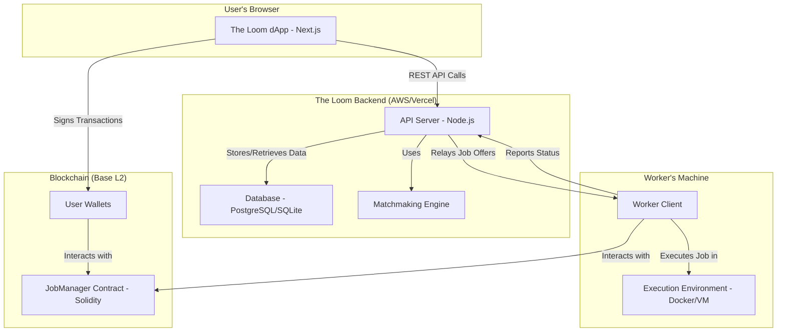

# Architecture Overview

The Loom's architecture is designed as a hybrid system that leverages the strengths of both traditional backend services and decentralized blockchain technology. This approach ensures a seamless user experience while maintaining the security and trustlessness required for a decentralized marketplace.

The system can be broken down into four main pillars:

1.  **The Loom dApp (Frontend):** The user-facing interface for interacting with the network.
2.  **Backend Services (Off-Chain):** A set of centralized services for tasks that are inefficient to run on-chain, such as matchmaking and job management.
3.  **Worker Nodes (Off-Chain):** The global network of computers that provide computational power.
4.  **Blockchain Layer (On-Chain):** The trust layer, responsible for value exchange and state verification.

### Component Interaction Diagram

---

### 1. The Loom dApp (Frontend)

-   **Technology:** A Next.js single-page application.
-   **Function:** This is the primary entry point for both Clients and Workers.
-   **Responsibilities:**
    -   Allows users to connect their Web3 wallets (e.g., MetaMask).
    -   Provides an interface for Clients to define job specifications (e.g., task type, input data, budget) and submit them to the backend.
    -   Displays a marketplace of available jobs for Workers.
    -   Shows real-time status updates for ongoing jobs.
    -   Facilitates user interaction with the `JobManager` smart contract to deposit and confirm funds.

### 2. Backend Services (Off-Chain)

-   **Technology:** A Node.js (Express) server with a SQL database.
-   **Function:** Acts as the central nervous system for the platform, handling off-chain operations.
-   **Responsibilities:**
    -   **User & Job Management:** Manages user profiles and job listings that are not yet on the blockchain.
    -   **Matchmaking:** The matchmaking engine connects job requests from Clients with the most suitable Workers based on hardware, availability, and reputation.
    -   **State Caching:** Caches data from the blockchain to present it quickly to the user without requiring direct blockchain queries for every page load.
    -   **Communication Relay:** Facilitates communication between Clients and Workers for job negotiation and status updates.

### 3. Worker Nodes (Off-Chain)

-   **Technology:** A lightweight client application (e.g., Python, Go, or Node.js) that runs on the provider's machine.
-   **Function:** The "engine" of the network, executing the computational tasks.
-   **Responsibilities:**
    -   Registers the worker's hardware and availability with the backend.
    -   Listens for job offers from the matchmaking service.
    -   Accepts jobs and communicates with the `JobManager` smart contract to lock collateral.
    -   Pulls the necessary data and executes the computation, often within a secure, containerized environment (like Docker) to ensure safety and dependency management.
    -   Returns the results to the Client and reports task completion to the backend.

### 4. Blockchain Layer (On-Chain)

-   **Technology:** Solidity smart contracts deployed on the **Base** Layer 2 network.
-   **Function:** The ultimate source of truth and the trustless financial layer.
-   **Responsibilities:**
    -   **Escrow & Payments:** The `JobManager` contract holds the Client's payment in escrow and the Worker's collateral. It ensures that funds are only released when both parties agree the job is complete, or according to predefined rules in case of a dispute.
    -   **State & Agreement:** It records the immutable agreement between the Client and the Worker, including the job price and completion criteria.
    -   **Reputation (Future):** Can be extended to store reputation tokens or scores for Workers, creating a more robust trust system.
