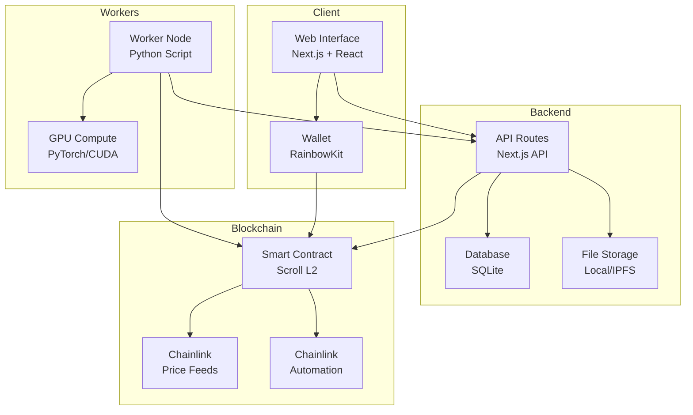
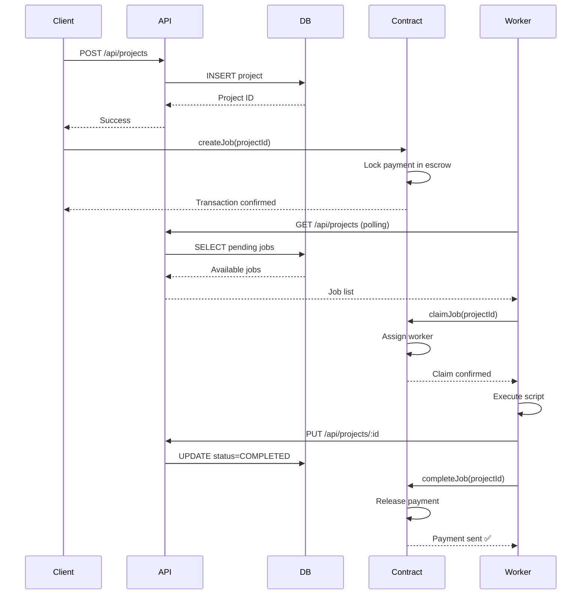
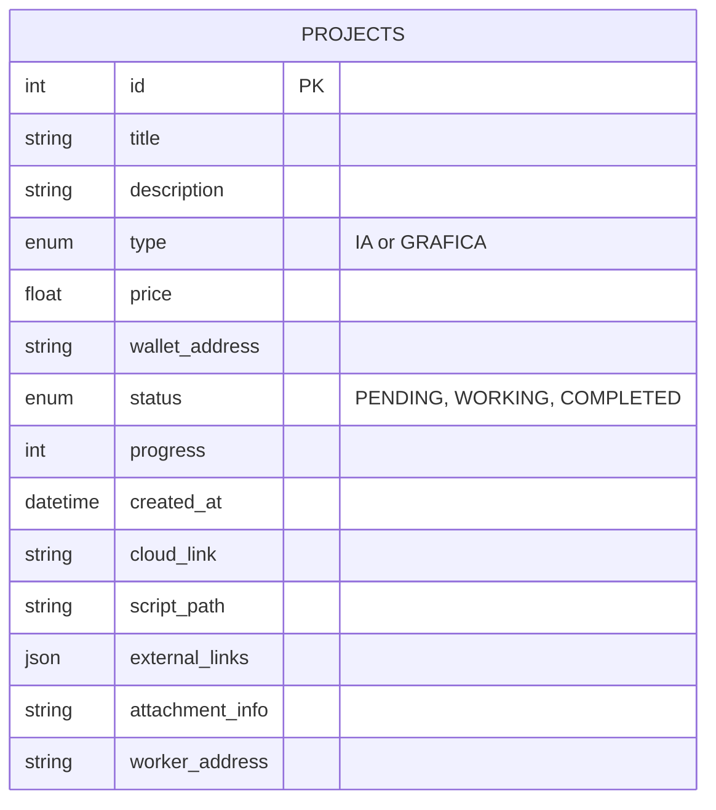

# Architecture Overview

This page explains the high-level architecture of The Loom.

## System Architecture



---

## Data Flow

### Creating a Job



---

## Tech Stack

### Frontend Layer

| Technology | Purpose | Why |
|------------|---------|-----|
| **Next.js 14** | Framework | SSR, API routes, file routing |
| **React 18** | UI Library | Component-based, hooks |
| **TailwindCSS** | Styling | Utility-first, responsive |
| **RainbowKit** | Web3 UI | Pre-built wallet connection |
| **wagmi** | Web3 Hooks | React hooks for Ethereum |
| **TanStack Query** | Data Fetching | Caching, automatic refetch |

### Backend Layer

| Technology | Purpose | Why |
|------------|---------|-----|
| **Next.js API Routes** | REST API | Same codebase as frontend |
| **SQLite** | Database | Simple, file-based, no setup |
| **FormData API** | File Upload | Handle script uploads |

### Blockchain Layer

| Technology | Purpose | Why |
|------------|---------|-----|
| **Solidity 0.8.20** | Smart Contracts | Industry standard |
| **Scroll L2** | Deployment Network | Low fees, EVM-compatible |
| **Chainlink Price Feeds** | USD→ETH Conversion | Decentralized oracles |
| **Chainlink Automation** | Auto-release Payments | Keeper network |

### Worker Layer

| Technology | Purpose | Why |
|------------|---------|-----|
| **Python 3.10+** | Worker Script | ML/AI ecosystem |
| **PyTorch** | AI Training | Most popular ML framework |
| **CUDA** | GPU Acceleration | NVIDIA GPU support |

---

## Database Schema



### Schema Details

```sql
CREATE TABLE projects (
  id INTEGER PRIMARY KEY AUTOINCREMENT,
  title TEXT NOT NULL,
  description TEXT,
  type TEXT CHECK(type IN ('IA', 'GRAFICA')),
  price REAL NOT NULL,
  wallet_address TEXT,
  status TEXT DEFAULT 'PENDING',
  progress INTEGER DEFAULT 0,
  created_at DATETIME DEFAULT CURRENT_TIMESTAMP,
  cloud_link TEXT,
  script_path TEXT,
  external_links TEXT, -- JSON array
  attachment_info TEXT,
  worker_address TEXT
);
```

---

## Smart Contract Architecture

```solidity
contract TheLoomEscrow {
    struct Job {
        address client;      // Who posted the job
        uint256 payment;     // Amount locked
        address worker;      // Who claimed it
        bool completed;      // Completion status
        uint256 deadline;    // Timeout (7 days)
    }
    
    mapping(uint256 => Job) public jobs;
    
    // Client deposits payment
    function createJob(uint256 jobId) external payable;
    
    // Worker claims job
    function claimJob(uint256 jobId) external;
    
    // Worker marks as done
    function completeJob(uint256 jobId) external;
    
    // Auto-refund if timeout
    function refundExpired(uint256 jobId) external;
}
```

---

## Security Considerations

### ✅ Implemented

- ✅ **Escrow Pattern**: Payments locked until completion
- ✅ **Wallet Validation**: Ethereum address format check
- ✅ **SQL Injection Protection**: Parameterized queries
- ✅ **File Upload Sanitization**: Filename cleaning

### 🚧 Future Improvements

- 🚧 **Proof of Work**: Verify computation actually happened
- 🚧 **Script Sandboxing**: Docker containers for security
- 🚧 **Reputation System**: NFT badges for reliable workers
- 🚧 **Dispute Resolution**: Oracle-based arbitration

---

## Performance Metrics

| Operation | Time | Cost |
|-----------|------|------|
| Create Job (DB) | ~50ms | Free |
| Create Job (Blockchain) | ~2-5s | ~$0.01 (Scroll L2) |
| Claim Job | ~2s | ~$0.005 |
| Complete Job | ~3s | ~$0.01 |
| Worker Poll Interval | 10s | N/A |

---

## Scalability

### Current Limits (MVP)

- **Jobs**: Unlimited (SQLite can handle 140TB)
- **File Size**: 100MB max upload
- **Concurrent Workers**: 10-20 (polling bottleneck)
- **Transactions/sec**: ~10 (Scroll L2 limit)

### Future Scaling

- **IPFS**: Decentralized file storage
- **PostgreSQL**: Production-grade database
- **WebSockets**: Real-time job updates
- **Zk-Rollups**: Higher TPS on Layer 2

---

## Next Steps

- [Frontend Architecture →](/architecture/frontend)
- [Smart Contract Details →](/smart-contracts/overview)
- [API Reference →](/api/overview)