# Quick Start Guide

Get The Loom running locally in under 5 minutes!

## Prerequisites

Before you begin, ensure you have:

- ✅ Node.js 18+ installed
- ✅ A Web3 wallet (MetaMask recommended)
- ✅ Some testnet ETH (Scroll Sepolia)

:::tip Get Testnet ETH
Visit [Scroll Faucet](https://sepolia.scrollscan.com/faucet) to get free testnet tokens.
:::

---

## Step 1: Clone & Install

```bash
# Clone the repository
git clone https://github.com/your-username/the-loom.git
cd the-loom

# Install dependencies
npm install

# Create environment file
cp .env.example .env.local
```

---

## Step 2: Configure Environment

Edit `.env.local`:

```bash title=".env.local"
# Database (auto-created on first run)
DATABASE_URL="file:./the-loom-hackathon.db"

# Blockchain (Scroll Sepolia)
NEXT_PUBLIC_CHAIN_ID=534351
NEXT_PUBLIC_RPC_URL="https://sepolia-rpc.scroll.io"

# Smart Contract (after deployment)
NEXT_PUBLIC_ESCROW_CONTRACT="0x..."

# WalletConnect Project ID (get from https://cloud.walletconnect.com)
NEXT_PUBLIC_WALLETCONNECT_PROJECT_ID="your-project-id"
```

---

## Step 3: Initialize Database

The database is automatically created on first run. To verify:

```bash
npm run dev
```

You should see:

```
✅ Database connected
✅ Demo projects seeded
🚀 Server running on http://localhost:3000
```

---

## Step 4: Connect Your Wallet

1. Open `http://localhost:3000`
2. Click **"Connect Wallet"** in the top-right
3. Select your wallet (MetaMask, Coinbase, etc.)
4. Approve the connection


---

## Step 5: Post Your First Job

### As a Client (Need GPU compute):

1. Click **"Post a Job"**
2. Fill in the form:
   ```
   Title: Train MNIST Model
   Type: IA
   Price: 2.5 USDC
   Dataset Link: https://example.com/mnist.zip
   Script: Upload your Python training script
   ```
3. Click **"Create"**
4. Approve the transaction in your wallet

### As a Worker (Have GPU to share):

1. Go to **"Explore Jobs"**
2. Find an available job
3. Click **"Start Job"**
4. The worker node will automatically execute

:::warning Coming Soon
Worker node automation is in development. For now, jobs progress automatically for demo purposes.
:::

---

## Step 6: Monitor Progress

Jobs go through 3 states:

```mermaid
graph LR
    A[PENDING] -->|Worker Claims| B[WORKING]
    B -->|Execution Complete| C[COMPLETED]
    C -->|Payment Released| D[💰]
```



Watch the progress bar update in real-time!

---

## Next Steps

- 📖 [Learn about the Architecture](/getting-started/architecture/overview)
- 🔗 [Deploy Smart Contracts](/smart-contracts/deployment)
- ⚙️ [Setup Worker Node](/worker-node/setup)
- 📡 [Explore API Endpoints](/api/overview)

---

## Troubleshooting

### Database not created?

```bash
# Manually create
touch the-loom-hackathon.db
npm run dev
```

### Wallet not connecting?

1. Check you're on Scroll Sepolia network
2. Verify WalletConnect Project ID in `.env.local`
3. Clear browser cache and retry

### Upload failing?

Ensure `public/uploads/` directory exists:

```bash
mkdir -p public/uploads
```

---

## 🎉 You're Ready!

You now have The Loom running locally. Start experimenting with:
- Creating different job types (IA vs GRAFICA)
- Uploading various scripts
- Testing the payment flow

Need help? Join our [Discord](https://discord.gg/theloom) or check the [FAQ](/faq).