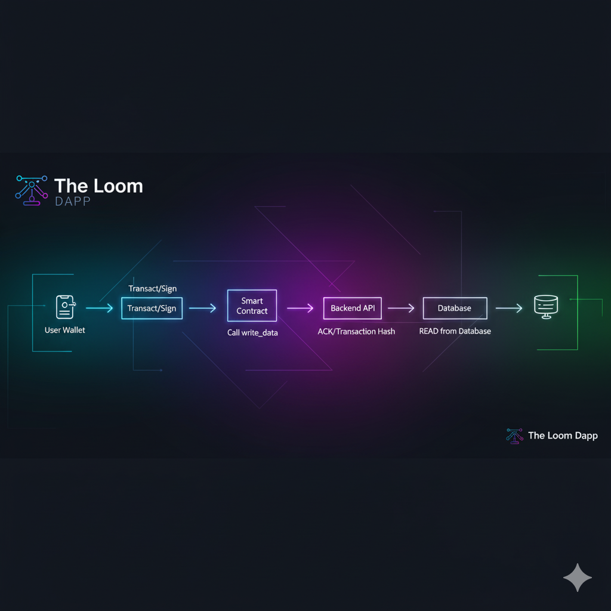

# Welcome to The Loom



:::tip Live Demo
Try the live application at [the-loom.vercel.app](https://the-loom.vercel.app)
:::

## 🎯 What is The Loom?

**The Loom** is a decentralized marketplace that connects people who need GPU computing power with those who have idle GPUs. Think of it as "Uber for GPU Computing".

### The Problem

- 🏢 **Cloud GPU costs $1-5/hour** (AWS, Google Cloud)
- 💻 **Gaming GPUs sit idle 80% of the time**
- 🤖 **AI researchers need affordable compute**
- 🎨 **3D artists need rendering power**

### Our Solution

```
┌─────────────┐                    ┌──────────────┐
│   Client    │  Posts Job + $$$   │ Smart Contract│
│  (AI/3D)    │ ──────────────────▶│   (Escrow)    │
└─────────────┘                    └──────────────┘
                                           │
                                           │ Releases Payment
                                           ▼
                                    ┌──────────────┐
                                    │    Worker    │
                                    │  (GPU Owner) │
                                    └──────────────┘
```

### Key Features

- ✅ **Trustless Escrow** via Smart Contracts
- ✅ **Pay with Crypto** (USDC, ETH)
- ✅ **Automated Payments** via Chainlink
- ✅ **60-80% Cost Savings** vs. traditional cloud

---

## 🏆 Hackathon Sponsors

This project was built for [Hackathon Name] using:

<div style={{display: 'flex', gap: '2rem', alignItems: 'center', margin: '2rem 0'}}>
  
  
  
</div>

### Integration Points

| Sponsor | Usage |
|---------|-------|
| **Chainlink** | Price Feeds (USD→ETH) + Automation (auto-release) |
| **Scroll** | Layer 2 for cheap transactions |
| **Ethereum** | Base layer security |

---

## 🚀 Quick Start

Get started in 3 minutes:

```bash
# Clone the repository
git clone https://github.com/your-username/the-loom
cd the-loom

# Install dependencies
npm install

# Start development server
npm run dev
```

Visit `http://localhost:3000` to see the app!

👉 [Full Installation Guide →](/getting-started/installation)

---

## 📚 Documentation Structure

- **Getting Started**: Installation, configuration, first steps
- **Architecture**: System design and data flow
- **Smart Contracts**: Solidity code and deployment
- **API Reference**: REST endpoints and usage
- **Worker Node**: How to contribute GPU power

---

## 🎥 Demo Video

<iframe 
  width="100%" 
  height="400" 
  src="https://www.youtube.com/embed/YOUR_VIDEO_ID" 
  frameBorder="0" 
  allow="accelerometer; autoplay; clipboard-write; encrypted-media; gyroscope; picture-in-picture" 
  allowFullScreen
/>

---

## 🤝 Team

Built by:
- **[Seu Nome]** - Full Stack + Smart Contracts
- **[Membro 2]** - Frontend + Design
- **[Membro 3]** - Backend + Infrastructure

---

## 📞 Contact

- 📧 Email: team@theloom.io
- 🐦 Twitter: [@TheLoomNetwork](https://twitter.com/theloom)
- 💬 Discord: [Join our server](https://discord.gg/theloom)

---

:::info Next Steps
Ready to dive in? Start with the [Quick Start Guide →](/getting-started/quick-start)
:::