# Smart Contracts Overview

The Loom's on-chain logic is the trust engine of our platform. It guarantees that clients pay for completed work and workers are compensated fairly, all without relying on a central intermediary. Our entire on-chain presence is orchestrated by a single, powerful contract: `JobManager.sol`.

## The JobManager Contract

`JobManager.sol` is the heart of our decentralized marketplace. It's a Solidity smart contract deployed on the **Base** network that functions as a trustless escrow and state machine for every computational job on the network.

### Core Responsibilities:
- **State Tracking:** It tracks the lifecycle of each job, ensuring it moves through predefined states correctly.
- **Value Exchange:** It securely holds a client's payment and a worker's collateral in escrow.
- **Rule Enforcement:** It enforces the rules of the agreement. For example, it ensures a worker can only start a job after the client has deposited funds.
- **Dispute Resolution:** It provides mechanisms to handle disputes, such as refunding the client if a worker fails to complete a job on time.

---

### Job Lifecycle State Machine

The contract manages each job as a state machine. A job can only transition between states based on specific actions taken by the client or the worker. This ensures a predictable and secure process.

```mermaid
stateDiagram-v2
    [*] --> Posted

    Posted --> Accepted: Worker accepts
    Posted --> Cancelled: Client cancels

    Accepted --> Funded: Client deposits escrow
    Accepted --> Cancelled: Client or Worker cancels

    Funded --> InProgress: Worker confirms start
    Funded --> Cancelled: Client cancels (refund)

    InProgress --> Completed: Worker submits results
    InProgress --> Disputed: Timeout or issue raised

    Completed --> Closed: Client confirms & releases funds
    Completed --> Disputed: Client rejects results

    Disputed --> Closed: Resolution (payment or refund)
    Cancelled --> [*]
    Closed --> [*]
```

### Key States Explained:

-   **Posted:** A job has been created off-chain and is available for workers. The on-chain representation is minimal at this stage.
-   **Accepted:** A worker has committed to the job by locking a security collateral in the contract. The job is now reserved for them.
-   **Funded:** The client has deposited the full payment for the job into the escrow.
-   **InProgress:** The worker has confirmed they have started the computational task. A timeout period begins.
-   **Completed:** The worker has finished the task and submitted the results (or a proof of results) to the client.
-   **Closed:** The transaction is complete. The client has approved the work, the worker has been paid, and the worker's collateral has been returned.
-   **Cancelled / Disputed:** If something goes wrong, the job enters a state where funds can be returned according to the contract rules.

This state-driven design is fundamental to how The Loom provides a secure and automated marketplace for computational resources.
